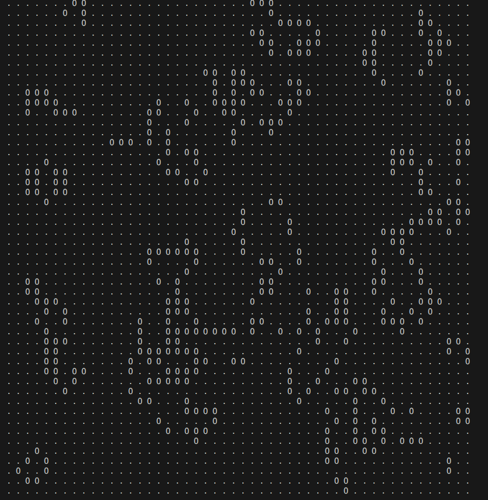

# Game of life 

Program stworzony na potrzeby kursu "Praktyka Programowania" na laboratoriach nr 2.

# Opis

Implementacja gry w życie Conway'a programując w parach.

Autorzy: 

Oskar Mulcan

Mikołaj Nowak